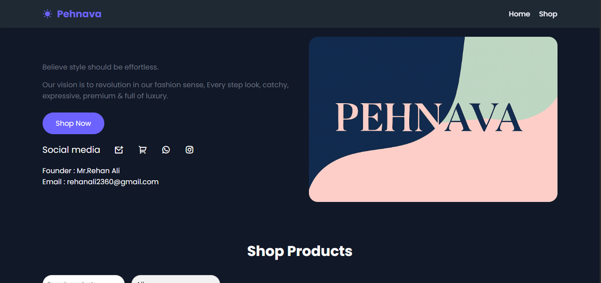

# 🛍️ Pehnava - E-Commerce Website

Pehnava is a modern and responsive E-Commerce website built to provide a seamless online shopping experience. The project features an attractive user interface, product listings, shopping cart functionality, and a clean, mobile-friendly design.

## 🌐 Live Demo

https://pehnava-ecommerce.netlify.app/

---

## 📸 Preview




---

## ✨ Features

- 🛒 Beautiful E-Commerce UI
- 📱 Fully Responsive Design
- 🛍️ Product Listing 
- 🔍 Product Search
- ❤️ Wishlist (if available)
- 🛒 Shopping Cart (Pending)
- 📦 Product Details Page (Pending)
- 💳 Checkout Page (Pending)
- 👤 User Authentication (if implemented)
- ⚡ Fast and Clean UI

---

## 🛠️ Tech Stack

### Frontend
- HTML5
- CSS3
- JavaScript

### Styling
- CSS
- Flexbox

### Version Control
- Git
- GitHub

---

## 📂 Folder Structure

```
pehnava-ecommerce-website/
│
├── assets/images
├── style.css
├── script.js
├── index.html
└── README.md

---

## 🚀 Installation

Clone the repository

```bash
git clone https://github.com/AshishPal80/pehnava-ecommerce-website.git
```

Go to the project folder

```bash
cd pehnava-ecommerce-website
```

Open the project

Simply open `index.html` in your browser.

OR

Use VS Code Live Server.

---

## 💻 Usage

- Browse products
- View product details
- Add items to cart (Pending)
- Continue shopping
- Checkout (if implemented) (Pending)

---

## 📱 Responsive Design

The website is optimized for:

- Desktop
- Laptop
- Tablet
- Mobile

---

## 🎯 Future Improvements

- User Login & Signup
- Payment Gateway Integration
- Order Tracking
- Admin Dashboard
- Product Filters
- Product Reviews
- Wishlist
- Dark Mode

---

## 🤝 Contributing

Contributions are welcome!

1. Fork the repository
2. Create your feature branch

```bash
git checkout -b feature-name
```

3. Commit your changes

```bash
git commit -m "Add new feature"
```

4. Push to the branch

```bash
git push origin feature-name
```

5. Open a Pull Request

---

## 📄 License

This project is licensed under the MIT License.

---

## 👨‍💻 Author

**Ashish Pal**

GitHub:
https://github.com/AshishPal80

---

## ⭐ Support

If you like this project, please consider giving it a ⭐ on GitHub!